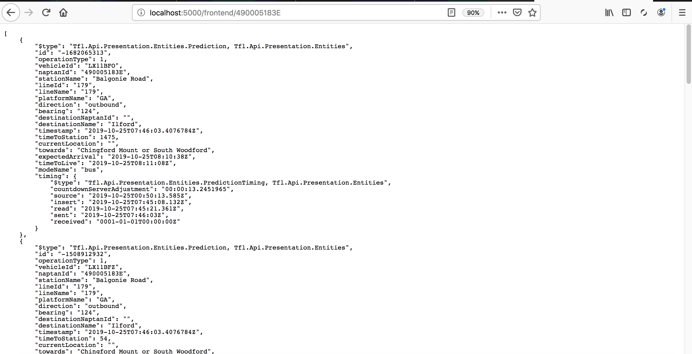
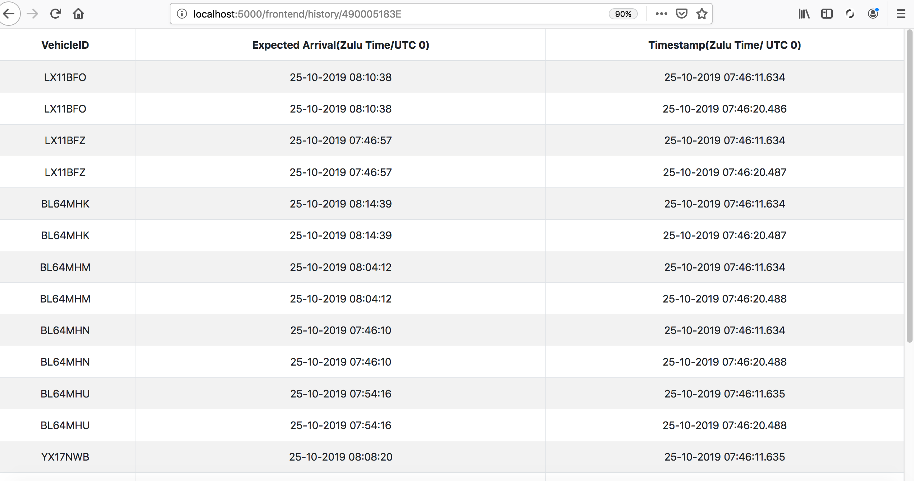
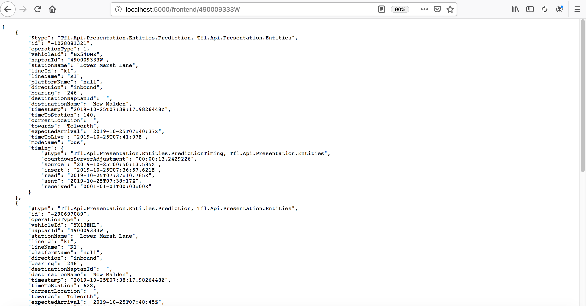
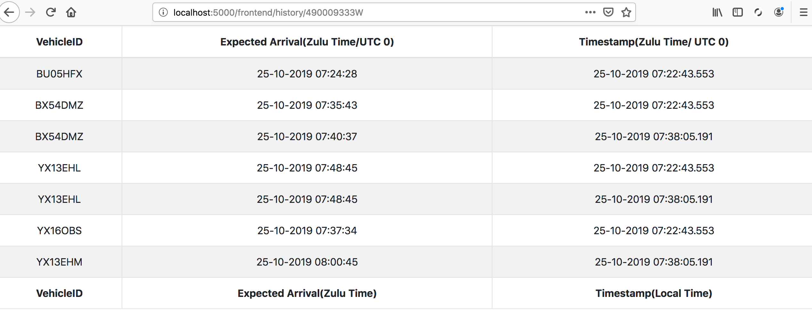
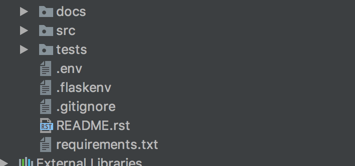

===========================================================
``tlf``: A simple web app to fetch arrivals for tlf.gov.uk
===========================================================

The solution designed here is simple and wanted to show adherence to the requirements rather than over thinking
it. Please see **Improvements** section for further details. The existing version of the web app has been
implemented using Flask, MongoDB, MongoEngine, JQuery, Bootstrap and the requests library.

According to api_tlf_ afresh data is provided every 30 seconds. For the purpose of this exercise this has been
ignored but in the "Further Improvements section" I explain what we can do about it. It has been ignored to have a
a first simple minimum viable product - MVP.

Dynamic endpoints
=================
The Flask app provides dynamic endpoints for each potential valid stop point on the TFL API. Those endpoints
are reachable like this:

1.  ``/frontend/<string:stop_id>``: If the last token of the querystring which represents a stop point is valid
    within the TFL API, the JSON data or such all is shown on the web. Otherwise a 404 error and page will be shown
2.  ``/history/<string:stop_id>``: Similarly, if any historical data of a given stop point has already been built
    a JQuery/Bootstrap data table is shown. Otherwise a 404 error and page wil be shown.

Api Calls
=========
As discussed before and for simplicity, every time you visit a **dynamic api endpoint** such ``/frontend/<string:stop_id>``
an API call is triggered. In theory this should only occur every 30 seconds only.

Similarly every time the **dynamic history endpoint** is visited historical data about that stop point will be
fetched.

The database model
==================
Although the requirements only asked to pull data from a specific stop point, the underlying database model has been
designed so that multiple stop points can be store. To do that a collection called ``StopPoint`` store document
that has the following fields:

1.  ``id``: The unique identifier of the stop point as provided by the TLF API
2.  ``arrivals``: A an array of embedded documents that keeps information about the each expected arrival.

Below you can see the model:

.. code-block:: python

    class Arrivals(db.EmbeddedDocument):
        vehicleId = db.StringField(max_length=15, required=True)
        expectedArrival = db.DateTimeField(required=True)
        timestamp = db.DateTimeField(default=datetime.utcnow)

    class StopPoint(db.Document):
        id = db.StringField(max_length=20, primary_key=True)
        utc_arrival_timezone = db.IntField(default=0)
        arrivals = db.EmbeddedDocumentListField(Arrivals)

The Subset Pattern
====================
It is difficult to understand what the exact requirements are but an application like this that would be in the
best case scenario pulling data every 30 seconds would create a problem of scalability. The design shown above
follows the Subset Pattern_.

The idea is that we would store a limited amount of arrivals bounded by an interval timeframe in the existing
model while all historical  fetched data would be in a separate collection. This would be a collection of
documents where each one represents data about one single arrival record.

With this design, we only keep some data to show in real time while the rest is stored - if needed - separately. So
we avoid the 16Mb size limit of each document as documented by MongoDB as per today.

Array of Embedded Documents vs Array of values
==============================================
Data about arrivals has been abstracted within an Embedded Document so that we can use indexes to improve the
performance of reads. I imagine an application where reads are done every 30 seconds or so but thousands of reads
could be done in a short interval of time. By using Embedded Documents we make the solution more scalable.

No indexes has been created but with MongoEngine ORM this is very straightforward.

In-place insertions
====================
Given that our model use embedded documents, the ``$add_to_set`` operator has been combined with Pymongo's ``update_one``
method and the ``upsert`` property. The idea is that if the document does not exist, then it is created. Otherwise
it is updated in-placed.

Some representative screenshots
===============================

Figure 1: 490005183E_json screenshot

Figure 2: 490005183E_table screenshot

Figure 3: 490009333W_json screenshot

Figure 4: 490009333W_table screenshot

Improvements
============
Again it is difficult to know what the exact requirements are however this solution could improve substantially
if:

1.  Indexes are created to speed up reads
2.  Api calls are done every 30 seconds rather than all the time.
3.  Use the ``Etag`` header to hash the content so that we tell the browser whether to use its cache or afresh data,
    HTTP is a synchronous protocol so the response needs to be sent back browser anyway, however we would return no
    generating less heavy traffic in our server.

Other solutions like intermediate in-memory databases could improve significantly the performance but the case studies
requires more thought.

..  _Pattern:
    https://www.mongodb.com/blog/post/building-with-patterns-the-subset-pattern

..  _api_tlf:
    https://tfl.gov.uk/info-for/open-data-users/our-open-data#on-this-page-3

Install and Run
================
The instructions provided below are only to run the application in development mode using Flask development web server.

a) Clone this repo and install the requirements as follows::

    $ pip install -r requirements.txt

b) Create a Mongo database, user and associate permissions

c) You need to set up your ``.env`` file as follows:

.. code-block:: bash

    SECRET_KEY = 'your secret key'

    DB = 'your_db'
    DB_USER = 'your_user'
    DB_PASSWORD = 'your_password'
    DB_HOST = 'your_host'
    DB_PORT = 'your_port'

d) Add a ``.flaskenv`` environmental file in you root folder as follows:

.. code-block:: bash

    FLASK_APP=src/app
    FLASK_ENV=development

e) Run the Flask server as follows::

    $ flask run

g) Point your browser to the end point http://localhost:5000/frontend/490009333W to fetch arrival data about "490009333W".
   Reload the page a couple of time to generate historical data. The JSON content returned from the API should be shown

f) Point your browser to the end point http://localhost:5000/frontend/history/490009333W to se historical data

*NB1*: If you go to f) before g) you will get a 404 error as described in the section above as such data isn't yet
avaiable.

*NB2*: Please see that that ``.env`` and ``.flaskenv`` need to be in the root folder. They are not provided with
the git sources. See figure below

